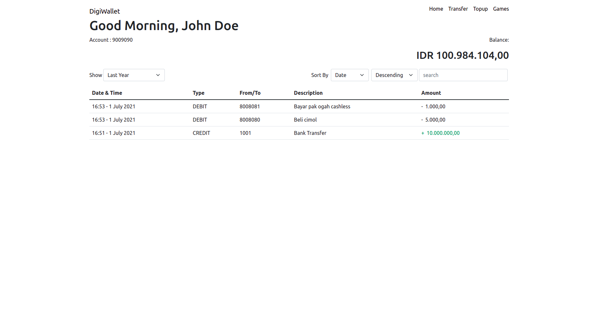
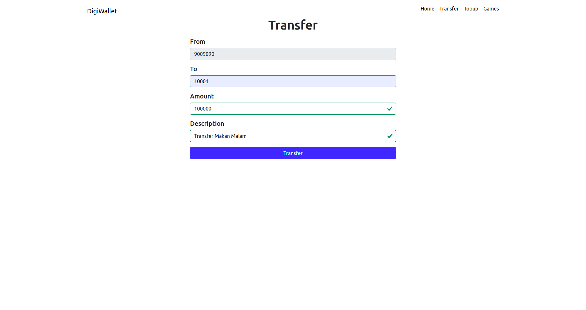
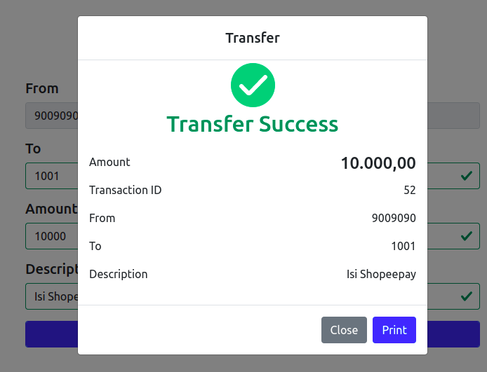
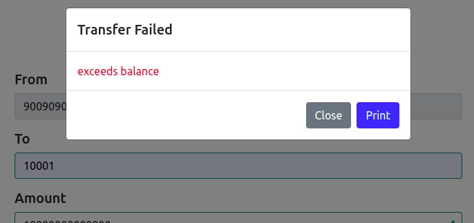
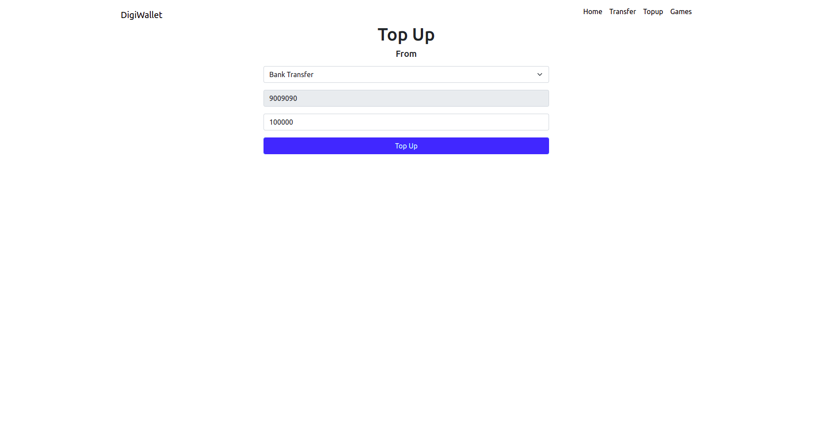
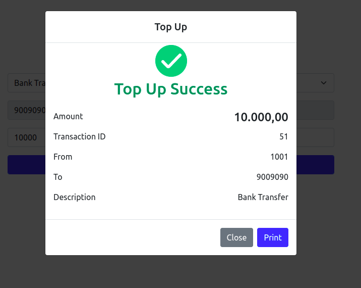
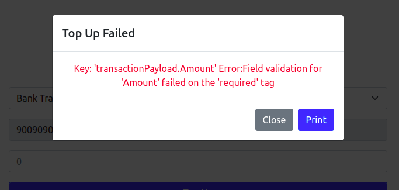
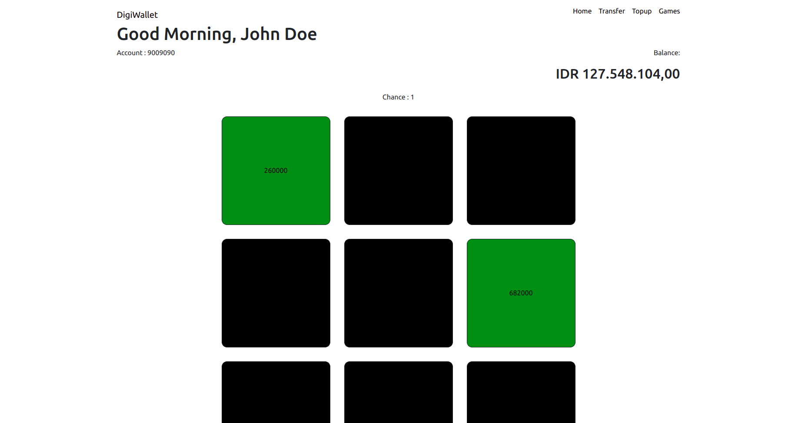
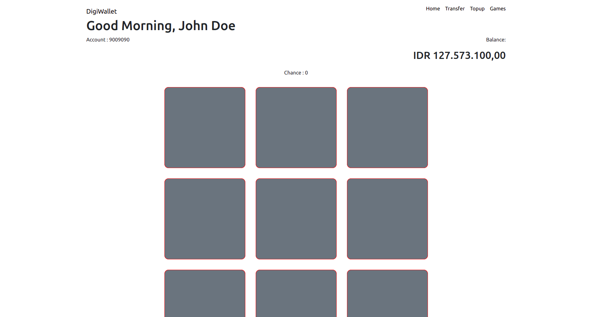

# DigiWallet

## About The App

DigiWallet is a wallet that allow you to Transfer to another account or Top Up to add your balance. You can also see you history 
of transaction by last 10 transaction, this month, last month, this year or last year
and sort it ascending or descending by date or by amount. And you can search transaction by keyword to find in description. 
And there is a games page to for you to play a games and add your balance.

## How to Setup

### 1. Clone the repository

Use `git clone {repository}` to clone it to your own device.

### 2. `npm i`

Install the modules that needed by the project.

## How to Run

### 1. `npm start`

The command is used to runs the app.\
Open `http://localhost:3000` to view it in your browser.

### 2. `PORT=3008 ./mock-wallet-api-linux.sh`

The command is used to mock the server and run it on port 3008.

## Screenshot

### Home

### Transfer

### Transfer Success

### Transfer Failed

### Topup

### Topup Success

### Topup Failed

### Games

### Games Over

